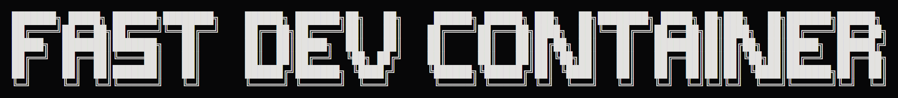

Lightweight CLI for fast & repeatable dev environments.

Create or attach a container for the current directory. Stops on exit unless using persistent mode (-d flag).

[](https://www.python.org/downloads/)
[](https://opensource.org/licenses/MIT)
[](https://deepwiki.com/philogicae/fast_dev_container)

## Installation

**Quick Install (Recommended):**
```bash
curl -fsSL https://raw.githubusercontent.com/philogicae/fast_dev_container/main/install | bash
```

**Manual Install:**
```bash
git clone https://github.com/philogicae/fast_dev_container.git ~/.fdevc
echo 'source ~/.fdevc/fdevc.sh' >> ~/.bashrc  # or ~/.zshrc
source ~/.bashrc  # or ~/.zshrc
```

**Requirements:** Docker (or Podman/compatible), Python 3, and Git.

## Usage

```bash
fdevc [id|name] [OPTIONS]     # Start/attach container (omit id|name for current dir)
fdevc new [OPTIONS]           # Create timestamped container
fdevc vm [OPTIONS]            # Create VM-like container (no volume/socket)
fdevc ls                      # List containers (● running, ○ stopped, ◌ saved)
fdevc stop [id|name]          # Stop container (omit for current dir)
fdevc rm [id|name] [--all]    # Remove container (--all deletes config)
fdevc config [--rm] [id|name] # Show/manage saved configs
fdevc custom                  # Copy template Dockerfile as fdevc.Dockerfile
fdevc --help                  # Show detailed help
```

**Common options:**
- `-i IMAGE|DOCKERFILE` - Custom image or Dockerfile path
- `-p "8080 3000:3001"` - Port mappings (space-separated)
- `-c CMD` / `--c-s CMD` - Run command on attach (--c-s saves for future)
- `-d` / `--tmp` - Persist on exit / Remove on exit
- `-f, --force` - Recreate if config differs
- `--dkr podman` - Use alternative runtime
- `--no-v` / `--no-s` - Skip volume/socket mount

**Notes:** Use `fdevc.Dockerfile` in current dir for custom image (create with `fdevc custom`). Use `fdevc ls` to get container indices. Run `fdevc --help` for all options.

## Examples

```bash
fdevc                              # Start/attach container for current dir
fdevc -p "8080:80 3000"            # With port mappings
fdevc -i ubuntu:22.04              # With custom image
fdevc --c-s "npm run dev"          # With saved startup command
fdevc new --tmp --no-v             # Temporary isolated environment
fdevc vm -i debian:13-slim         # VM-like container
fdevc ls                           # List all (use id to start: fdevc 1)
fdevc --dkr podman                 # Use Podman instead of Docker
```

## Configuration

Settings saved to `~/.fdevc/.dev_config.json`. Override defaults with environment variables:

```bash
export FDEVC_PYTHON="python3" # Path/interpreter for Python
export FDEVC_DOCKER="podman" # Docker, Podman, containerd
export FDEVC_IMAGE="/path/to/Dockerfile" # Path to a Dockerfile
export FDEVC_IMAGE="debian:13-slim" # Docker image
```

## Changelog

See [CHANGELOG.md](CHANGELOG.md) for a history of changes to this project.

## Contributing

Contributions are welcome! Please open an issue or submit a pull request.

## License

This project is licensed under the MIT License - see the [LICENSE](LICENSE) file for details.